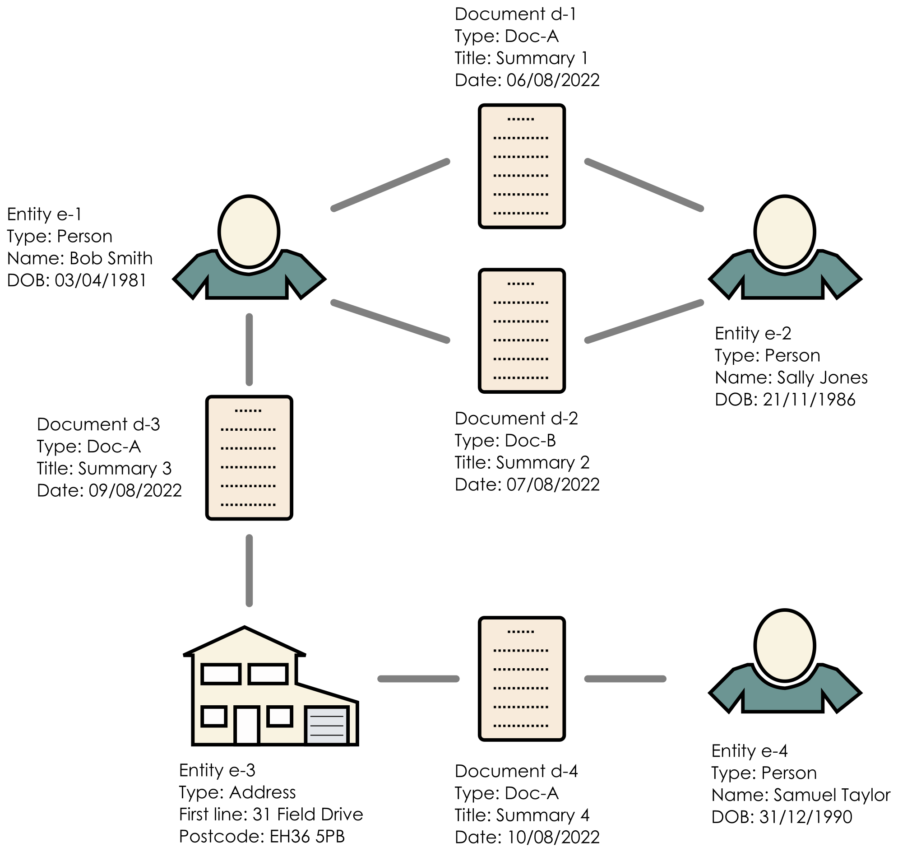
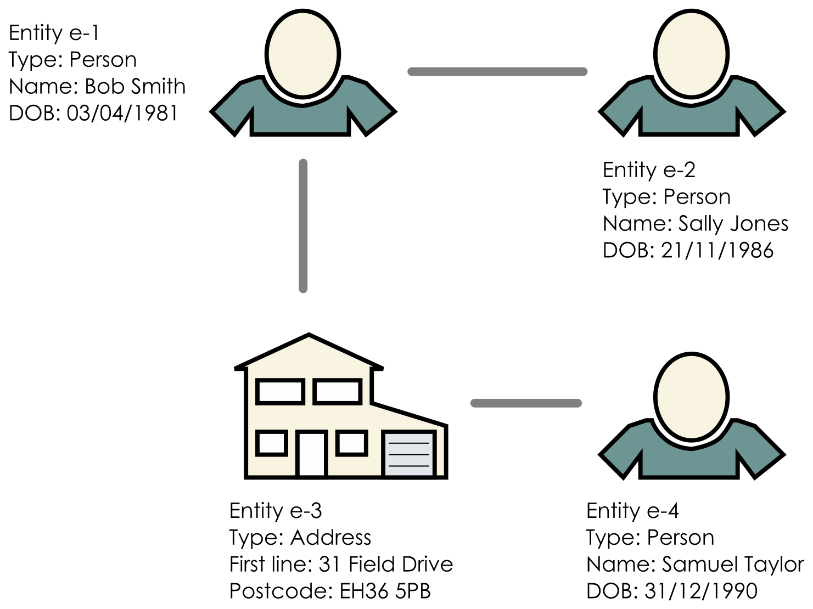

# Shortest path web-app

## Introduction

This Golang project contains the backend server and frontend web-app to find all paths between a
user-defined set of vertices in an undirected network. The number of hops from one entity to another
is configurable, as are the entities of interest. If one or more paths exist, then the an Excel file
is returned that can be imported into a network visualisation tool, such as i2 Analyst Notebook, or
used for analysis (e.g. in Python).

The underlying network is assumed to be a bipartite graph, specifically linking entities to
documents. The code collapses the bipartite graph to a unipartite graph for search efficiency
reasons. For example, a pair of authors could write a number of papers together, but the
connectivity of the authors is more important than the papers themselves.

A simple bipartite graph is shown below.



The bipartite graph is internally converted to the simple unipartite shown below.



The web-app uses an in-built Pebble key-value store and so no other database is required.

## Quick demo

Build and test the executable using

```bash
./build.sh
```

and then run the demo using

```bash
./demo.sh
```

The demo uses one of the small test datasets, but it's enough to show the functionality.
Navigate to http://localhost:8090 to access the web-app.

To see a case whereby there are no paths (and thus no chart), set:

- `Maximum number of hops from one entity to another`: 1
- `Dataset 1`: Test
- `Entity IDs`: e-1, e-4

To generate an i2 chart, set:

- `Maximum number of hops from one entity to another`: 2
- `Dataset 1`: Test
- `Entity IDs`: e-1, e-4

## Input data

The software requires the input data to be in the form of CSV files. At a high-level, there are four
types of file:

- Entity files
- Document files
- Links files
- Skip entities file

The code assumes that every entity and every document has a unique identifier. Due to the way the
data is stored in internally, the same identifier value can be shared by an entity and a document,
e.g. the identifier '0001'.

Each CSV file can have its own delimiter type. Note however that the data can only be encapsulated
in double quotes.

The CSV files can contain columns that are not used in the backend, i.e. they are ignored. If a
record contains an incorrect number of columns, then it will be ignored.

The CSV files the backend server should read are specified in a JSON configuration file. The file is
typically called `data-config.json`.

A convention-over-configuration approach has been employed whereby the CSV files should be a folder
called `data` in the same directory as the JSON configuration file.

### Entity file

Each entity CSV file contains zero or more entities of a given type or class (e.g. Person, Vehicle,
etc.) At a minimum, the file must contain a field for the entity ID. If the entity ID is blank, that
record will be ignored.

### Document file

Each document CSV file contains zero or more documents of a given type or class. The file must
contain a document ID field and a document date. If the document ID is blank, that record will be
ignored. The dates in the date column must have the same format, however, the date can be blank.

### Links file

A links CSV file just contains the fields for an entity ID and a document ID. Each row specifies the
connection between an entity and a document.

### Skip entities

Entities can be ignored when reading the graph from file to avoid finding shortest paths through
nodes with certain properties, e.g. a high betweenness centrality. This saves the user having to
pre-process the input CSV files to remove those entities and their connections.

Note that the backend reads just the single file specified. If no entities need to be skipped, then
just provide the filename of a blank file.

### JSON configuration file

The aforementioned four different types of input files are referenced in a JSON configuration file.
At a high-level, the JSON configuration file has this structure:

```json
{
  "graphData": {
    "entitiesFiles": [],
    "documentsFiles": [],
    "linksFiles": [],
    "skipEntitiesFile": "<file path>"
  },
  "bipartiteGraphConfig": {},
  "unipartiteGraphConfig": {}
}
```

The `graphData` object contains objects for each type of file to read with the exception being the
`skipEntitiesFile`, which is just the filename of a single text file.

An example of an `entitiesFile` object is:

```json
{
  "path": "person.csv",
  "entityType": "Person",
  "delimiter": ",",
  "entityIdField": "entity ID",
  "fieldToAttribute": {
    "forename": "Forename",
    "surname": "Surname",
    "date of birth": "DOB"
  }
}
```

The fields of an `entitiesFile` object are:

- `path` -- filename of the CSV file within the `data` folder.
- `entityType` -- type of entity. This is referenced in the i2 configuration file.
- `delimiter` -- a single character that is the delimiter within the CSV file, e.g. a comma.
- `entityIdField` -- field name within the CSV file for the entity ID. The field must be present for
  the file to be read.
- `fieldToAttribute` -- mapping from a field name in the CSV file to an entity's attribute. In the
  example above, the `forename` field in the CSV file is mapped to an entity attribute called
  `Forename`. Any fields in the CSV file that are not included in the `fieldToAttribute` map are
  ignored.

An example of a `documentsFile` object is:

```json
{
  "path": "documents-A.csv",
  "documentType": "Doc-A",
  "delimiter": ",",
  "documentIdField": "document ID",
  "fieldToAttribute": {
    "title": "Title",
    "date": "Date"
  }
}
```

The fields of a `documentsFile` object are:

- `path` -- filename of the CSV file within the `data` folder.
- `documentType` -- type of document. This is summarised on the i2 chart when two entities are
  linked.
- `delimiter` -- a single character that is the delimiter within the CSV file, e.g. a comma.
- `documentIdField` -- field name within the CSV file for the document ID. The field must be present
  for the file to be read.
- `fieldToAttribute` -- mapping from a field name in the CSV file to a document's attribute. In the
  example above, the `date` field is mapped to a document attribute called `Date`. Note that the
  `Date` attribute is expected to exist as it is used when summarising links between entities on the
  i2 chart.

An example of a `linksFile` object is:

```json
{
  "path": "links.csv",
  "entityIdField": "entity ID",
  "documentIdField": "document ID",
  "delimiter": ","
}
```

The fields of a `linksFile` object are:

```json
{
  "path": "links.csv",
  "entityIdField": "entity ID",
  "documentIdField": "document ID",
  "delimiter": ","
}
```

- `path` -- filename of the CSV file within the `data` folder.
- `entityIdField` -- field name for the entity ID.
- `documentIdField` -- field name for the document ID.
- `delimiter` -- a single character that is the delimiter within the CSV file, e.g. a comma.

The `bipartiteGraphConfig` and `unipartiteGraphConfig` objects share the same structure and so just
examples for the `bipartiteGraphConfig` will be described. Suppose the graph should be held
in-memory. The object would be simply:

```json
"bipartiteGraphConfig": {
    "type": "memory"
}
```

When there is a lot of data, holding the unipartite and bipartite graphs in-memory ceases to be
feasible. An example of the configuration to use the Pebble backend is:

```json
"bipartiteGraphConfig": {
    "type": "pebble",
    "folder": "/pebble/bipartite",
    "deleteFilesInFolder": true
}
```

Pebble's data is stored in the location specified in the `folder` field. The folder should be empty
prior to ingesting the data. The backend will clear the folder if the `deleteFilesInFolder` field is
set to `true`.

## i2 chart configuration

The JSON configuration for the i2 chart generator should be stored in a file called
`i2-config.json`.

The web-app generates an Excel file for a given set of inputs that can be imported in i2 Analyst
Notebook using a suitably constructed 'Import Specification'. At a high-level, the Excel file has
the structure:

| Entity 1 columns | Entity 2 columns | Link |
| ---------------- | ---------------- | ---- |
|                  |                  |      |

At a high-level, the i2 configuration has this structure:

```json
{
  "columns": [],
  "entities": {},
  "links": {},
  "attributeNotKnown": "<string>"
}
```

The `columns` list contains the columns for a single entity. To create an i2 chart, `columns` is
typically set to:

```json
"columns": [
    "icon",
    "id",
    "label",
    "entitySets",
    "description"
],
```

The fields in this case are:

- `icon` -- image to use in i2 to represent the type of entity.
- `id` -- unique ID for the entity.
- `label` -- label to show underneath the entity.
- `entitySets` -- entity sets in which the entity was found. These come directly from the frontend
  if the entity was one of those specified by the user.
- `description` -- text shown when the user double-clicks the entity.

The `entities` object contains a map of entity type to its configuration. The entity types are taken
directly from those configured in the input entity CSV files. The fields within the entity object
must correspond to those in the `columns` list described above. There built-in placeholders that are
automatically populated with data are:

- `<ID>` -- entity ID.
- `<ENTITY-SET-NAMES>` -- entity sets in which the entity appears.

All of the attributes for an entity are available and can be included by simply surrounding the name
in angle brackets. For example, the `Forename` attribute can be referenced using `<Forename>`.

The `links` object must contain `dateAttribute` and `dateFormat` as these are used to summarise the
links. The `dateAttribute` is the attribute holding a document's date. The `dateFormat` must be in
Golang's time format. The date of a document is parsed to enable a date range to be calculated.

The in-built placeholders concerning documents are:

- `<NUM-DOCS>` -- number of documents in common between two entities.
- `<DOCUMENT-TYPES>` -- list of document types in common between two entities.
- `<DOCUMENT-DATE-RANGE>` -- earliest to latest dates of the documents. If there is a date, but not
  a range (e.g. due to just one document), then just a single date will be shown.

The `attributeNotKnown` field in the JSON configuration is the placeholder text for when an
attribute of an entity is not provided in the input CSV data.

## Message file

The application can present a simple HTML message on the index page. The intention of this is
provide the users with a quick summary of the network, e.g. when it was last updated or what
data is present. The file (typically called `message.html`) does not need to be a full HTML file.
For example, it could be as simple as:

```html
<p><b>Demo dataset</b> containing four entities</p>
```

## Build the Docker image

The `Dockerfile` in this project builds a minimal image in two stages. To build the image and run
with simple test data:

```bash
docker compose build
docker compose up
```

## Running behind an Apache HTTPD reverse proxy

The `proxy` folder contains configuration files for running the web-app behind an Apache HTTPD
reverse proxy. To build and run Docker images for a configured Apache proxy and the web-app, run:

```bash
docker-compose -f docker-compose-httpd.yml build
docker-compose -f docker-compose-httpd.yml up
```

Then navigate to http://192.168.99.100/shortestpath/ to test the web-app.

## Statistics endpoint

The `/stats` endpoint returns an HTML page with high level statistics about the bipartite and
unipartite graphs.

## Enhancements

### Pebble

During initial testing with a large volume of data it was found that the ingest time was very high,
prohibitively so. The Pebble backend was found to be a cause, and so a benchmark test was written
in the `graphstore` package. The benchmark can be run with:

```bash
cd graphstore
go test -run=Bench -bench=. -benchtime=10x
```

Tests where 10,000 entities were added to the bipartite graph Pebble backend were performed with and
without synchronisation. The results were:

| Synchronisation | Speed (ns/op)  |
| --------------- | -------------- |
| Sync            | 24,973,822,020 |
| NoSync          | 258,309,370    |

Therefore, turning synchronisation off yielded a 97 times speed up.

### Concurrency

The ingest of data is concurrent and so the entities and documents are read in in parallel.
Processing the links between entities and documents requires those to be present first, so the
reading of links happens after the entities and documents have been successfully ingested.

```bash
cd graphbuilder
go test -run=Bench -bench=. -count 1
```
